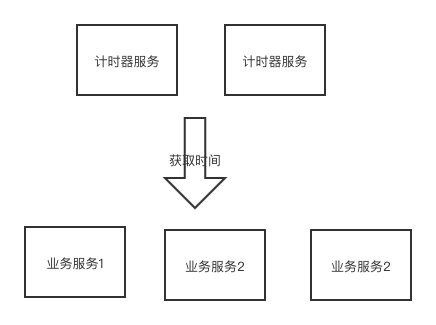

# tid

## 介绍

一个基于计时器的分布式id生成器(开发改进中)

tid是从xid改造而来，采用了相同的序列化方式（base64）,和比较相似的id格式：

- 4-byte 表示计时器时间（以秒为单位）
- 3-byte 客户端机器码
- 2-byte 客户端线程标志
- 3-byte 相同计时器时间的序列号

## 计时器服务

计时器服务每秒递增

## 系统架构

## TODO

- 添加注释
- 机器码获取
- 使用http2.0
- 计时器服务持久化设计
- 计时器服务高可用设计
- 压力测试